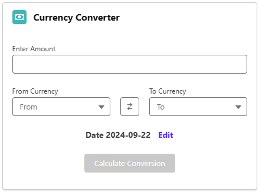
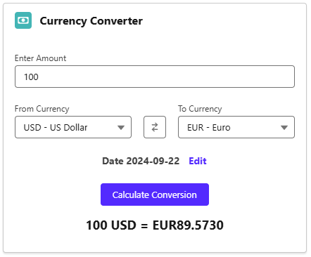
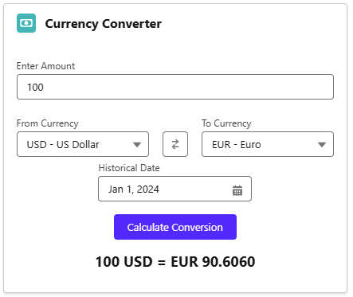

# Currency Converter LWC App

This is a Lightning Web Component (LWC) application that allows users to convert currencies using CurrencyAPI.

## Features

- Convert currencies in real-time
- Supports multiple currencies
- Live & Historical Rates For 170+ Currency Pairs
- User-friendly interface

## Resources

- https://currencyapi.com/docs
- https://www.lightningdesignsystem.com/
- https://developer.salesforce.com/docs/component-library/overview/components
- https://developer.salesforce.com/docs/platform/lwc/guide
- https://developer.salesforce.com/docs/platform/einstein-for-devs/guide/einstein-overview.html

